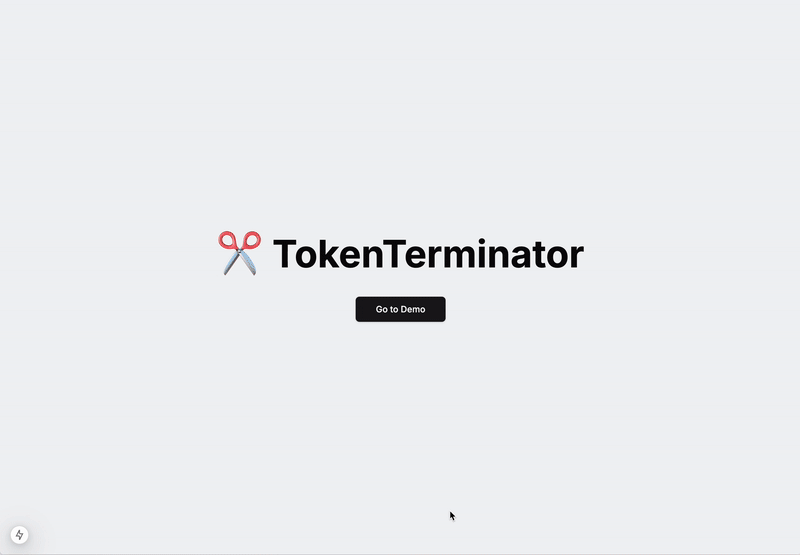

# TokenTerminator - Prompt Optimization Tool for LLMs

## Overview

TokenTerminator is a tool that optimizes prompts for LLMs to reduce token usage and associated costs. It uses a combination of techniques including prompt engineering, token counting, and model outputs comparison to achieve this goal. The tool was developed as a proof of concept during BCG Platinion's 2024 Hackathon.

## Backend

The backend is built with FastAPI and is hosted on AWS Lambda. It includes services for token counting, energy calculation, and model output comparison. The code can be found in the `backend` directory. Make sure to install the dependencies with `pip install -r requirements.txt` before running the code.

## Frontend

The frontend is built with Next.js and TailwindCSS. The code can be found in the `frontend` directory. Make sure to install the dependencies with `npm install` before running the code. Afterward, you can run the frontend with `npm run dev`.

## Future Work

1. Make the backend available as a standalone Python package. This can be used to save tokens as a middleware for any LLM service.
